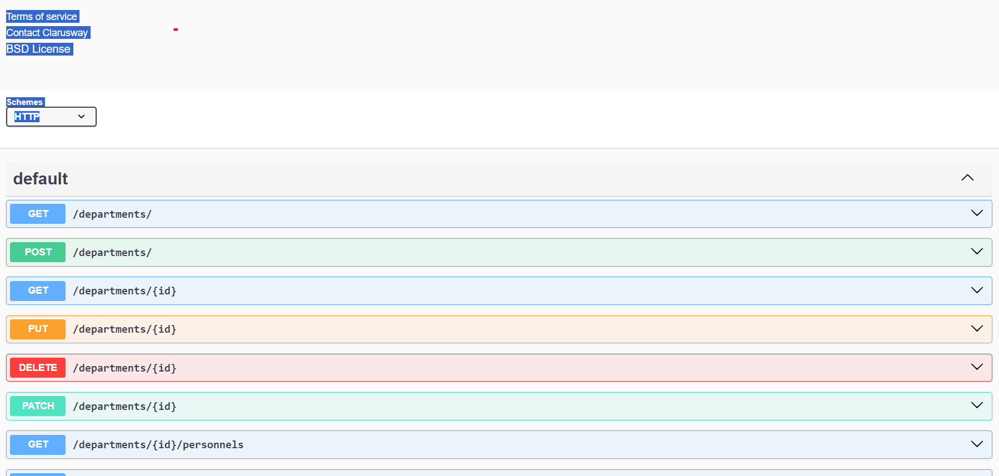

# PERSONNEL API

### ERD:




### Folder/File Structure:

```
    .env
    .gitignore
    index.js
    readme.md
    src/
        configs/
            dbConnection.js
        controllers/
            department.controller.js
            personnel.controller.js
        helpers/
            passwordEncrypt.js
        middlewares/
            errorHandler.js
            findSearchSortPage.js
        models/
            department.model.js
            personnel.model.js
        routes/
            department.router.js
            personnel.router.js
```

## vercel icin
sonra ana diyinde vercel.json
{
    "version": 2,
    "builds": [
        {
            "src": "index.js",
            "use": "@vercel/node"
        }
    ],
    "routes": [
        {
            "src": "/(.*)",
            "dest": "index.js"
        }
    ]
}